# NEC 节点加厚全景图（思维导图 + 目录架构）

> **用途：** 看清每个 Phase 的**传递方向**、**现有文件（可点击）**、**NEC-11 审计链（L0–L4）**。  
> **状态：** NEC-11 已落地 — `novel audit <mode>` + 各 Phase 语料/脚本；进度见 [§14](#14-nec-11-实施进度)。  
> **相关：** [NODE-EXECUTION-CONTRACT.md](../standards/NODE-EXECUTION-CONTRACT.md) ·
> [AUDIT-REFERENCES-INDEX.md](../standards/AUDIT-REFERENCES-INDEX.md) · [workflow/README.md](./README.md)

---

## 0. 全书生命周期（节点传递总览）

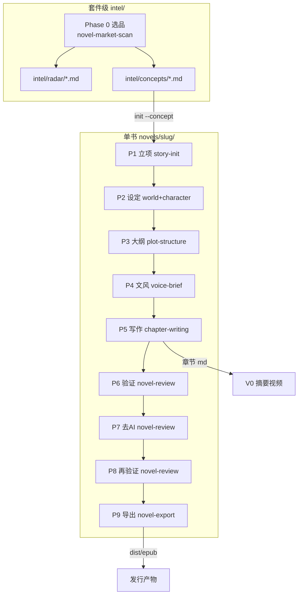

**宏观规则：** 用户话术 → [novel-pipeline](../../cursor-novel-writer/skills/novel-pipeline/SKILL.md) 选 Phase →
读该 Phase 的 `node-dispatch.md` → 执行 → 落盘 →
[pipeline gate](../../cursor-novel-writer/engine/scripts/pipeline_gate.py) /
[node validate](../../cursor-novel-writer/engine/scripts/node_completion.py)。

---

## 1. 横切四层加厚模型（每个节点都应长成这样）


| 层 | NEC-11 现状 |
| --- | --- |
| L0 | [audit-dispatch-index.md](../../cursor-novel-writer/skills/novel-review/references/audit-dispatch-index.md) · [deai-audit-dispatch.md](../../cursor-novel-writer/skills/novel-review/references/deai-audit-dispatch.md) |
| L1 | [deai-corpus](../../cursor-novel-writer/skills/novel-review/references/deai-corpus/README.md) · [platform-length-corpus.md](../../cursor-novel-writer/skills/novel-market-scan/references/platform-length-corpus.md) |
| L2 | `novel audit <mode>` → [engine/scripts](../../cursor-novel-writer/engine/scripts/) `*_audit.py` / `*_lint.py` |
| L3 | 各 Skill Agent（读 scan JSON + persona） |
| L4 | `reviews/*-scan.json` + [node_completion.py](../../cursor-novel-writer/engine/scripts/node_completion.py) |

---

## 2. Phase 0 — 市场扫榜（**当前唯一接近 hybrid 的样板**）

### 2.1 传递方向

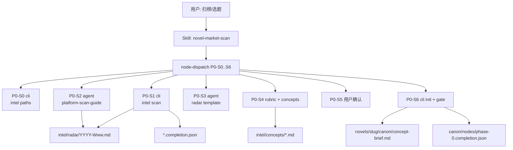

### 2.2 目录架构（可点击）

```text
cursor-novel-writer/skills/novel-market-scan/
├── SKILL.md                          → 入口
└── references/
    ├── node-dispatch.md              → P0 分派表（必读）
    ├── platform-scan-guide.md        → P0-S2 Agent 搜番茄/起点/晋江/盐选
    ├── radar-report-template.md      → P0-S3 雷达结构
    └── short-video-fit-rubric.md     → P0-S4 短视频评分

cursor-novel-writer/engine/scripts/
└── intel_scan.py                     → P0-S1 CLI（短视频平台）

intel/                                → 套件级产出（gitignore 用户数据）
├── README.md
├── radar/YYYY-Www.md
├── radar/YYYY-Www.completion.json
└── concepts/<slug>.md

docs/standards/
└── PLATFORM-LENGTH-AND-NORMS.md      → v2 拟绑：篇幅/章数（规划）

engine/scripts/intel_rubric_score.py     → P0-S4b `novel audit intel`
references/platform-length-corpus.md     → L1 篇幅摘要
```

### 2.3 子任务 ↔ 文件对照

| 子任务 | 执行体 | 现有文件 | NEC-11 |
| --- | --- | --- | --- |
| P0-S0 | cli | [novel_cli intel paths](../../cursor-novel-writer/engine/novel_cli.py) | — |
| P0-S1 | cli | [intel_scan.py](../../cursor-novel-writer/engine/scripts/intel_scan.py) | — |
| P0-S2 | agent | [platform-scan-guide.md](../../cursor-novel-writer/skills/novel-market-scan/references/platform-scan-guide.md) | [platform-length-corpus.md](../../cursor-novel-writer/skills/novel-market-scan/references/platform-length-corpus.md) |
| P0-S3 | agent | [radar-report-template.md](../../cursor-novel-writer/skills/novel-market-scan/references/radar-report-template.md) | — |
| P0-S4 | agent | [short-video-fit-rubric.md](../../cursor-novel-writer/skills/novel-market-scan/references/short-video-fit-rubric.md) | [intel_rubric_score.py](../../cursor-novel-writer/engine/scripts/intel_rubric_score.py) |
| P0-S5 | agent | [concept-brief 模板](../../cursor-novel-writer/templates/concept-brief.md) | — |
| P0-S6 | cli | `novel init --concept` · gate phase 1 | — |

---

## 3. Phase 1 — 立项

### 3.1 传递方向

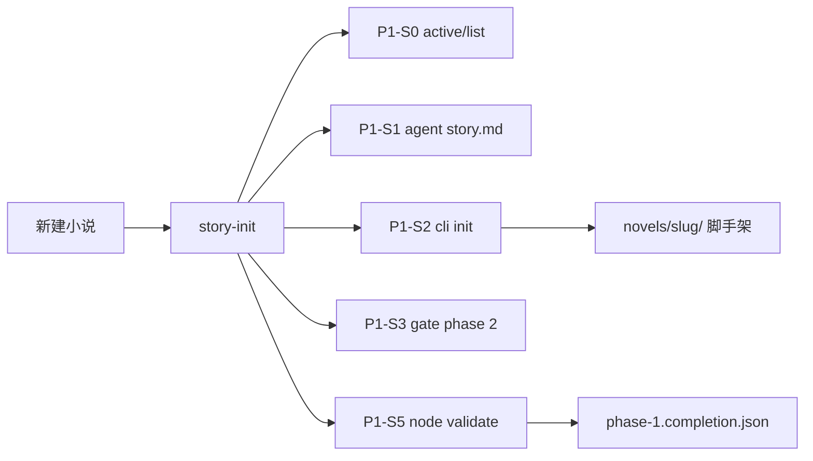

### 3.2 目录架构

```text
cursor-novel-writer/skills/story-init/
├── SKILL.md
└── references/
    ├── node-dispatch.md
    ├── story-template.md
    └── structure.md

novels/<slug>/
├── story.md
├── task_plan.md
├── canon/project.json
└── canon/nodes/phase-1.completion.json

engine/scripts/story_init_audit.py   → `novel audit story`
```

---

## 4. Phase 2 — 世界观 + 人物（并行 2a / 2b，共用一个 phase-2 manifest）

### 4.1 传递方向

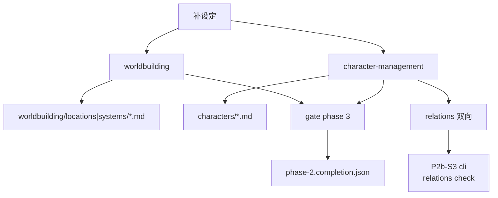

### 4.2 目录架构

```text
skills/worldbuilding/references/node-dispatch.md
skills/character-management/references/
├── node-dispatch.md
└── bidirectional-relations.md

novels/<slug>/
├── worldbuilding/locations/*.md
├── worldbuilding/systems/*.md
├── characters/*.md
└── canon/nodes/phase-2.completion.json

engine/scripts/validate_relations.py    → P2b-S3（已有 CLI）

engine/scripts/canon_lint.py           → `novel audit canon`
```

---

## 5. Phase 3 — 大纲（与你「12 节拍 → 百万字」直接相关）

### 5.1 传递方向

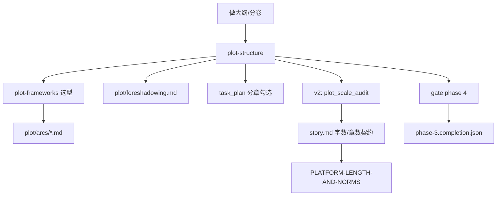

**理解校验：** 「12 章」应落在 **L1 节拍层**（`plot/arcs/master-12.md` 规划），**不是** 12 个 `chapters/*.md`；百万字靠 **分卷 + 分章表** 在 P3 定稿。

### 5.2 目录架构

```text
skills/plot-structure/references/
├── node-dispatch.md
└── plot-frameworks.md

novels/<slug>/plot/
├── arcs/*.md
├── foreshadowing.md
└── timeline.md（可选）

templates/plot-chapter-plan.md      → 分章表模板
templates/plot-master-12.md       → 12 节拍骨架（≠12 正文）
engine/scripts/plot_scale_audit.py → `novel audit plot`
docs/standards/PLATFORM-LENGTH-AND-NORMS.md
```

---

## 6. Phase 4 — 文风契约

### 6.1 传递方向

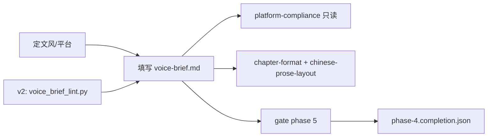

### 6.2 目录架构

```text
cursor-novel-writer/templates/voice-brief.md
templates/references/phase-4-node-dispatch.md

novels/<slug>/canon/voice-brief.md   → 运行时真源

skills/novel-review/references/
└── platform-compliance.md           → 发表/AI 红线（非词表）

skills/chapter-writing/references/
├── chapter-format.md
└── chinese-prose-layout.md

engine/scripts/voice_brief_lint.py    → `novel audit voice`
```

---

## 7. Phase 5 — 写作（SOLO 落盘主战场）

### 7.1 传递方向

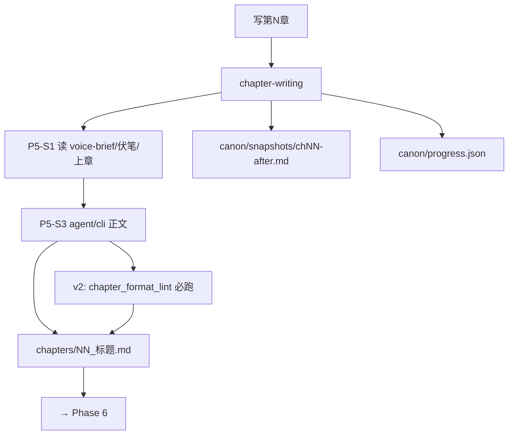

**理解校验：** 套件默认 **3500–5500 字/章**（见
[chapter-writing SKILL](../../cursor-novel-writer/skills/chapter-writing/SKILL.md)）；
2.0 另有 [chapter draft CLI](../../src/novel_suite/writer/chapter.py)，NEC 文档仍写 agent 写章，
**存在文档与引擎轻微脱节**。

### 7.2 目录架构

```text
skills/chapter-writing/
├── SKILL.md
└── references/
    ├── node-dispatch.md
    ├── chapter-format.md
    └── chinese-prose-layout.md

novels/<slug>/
├── chapters/NN_标题.md
├── chapters/.drafts/              → 验证期修订稿
├── canon/snapshots/chNN-after.md
├── canon/progress.json
└── canon/nodes/phase-5.completion.json

src/novel_suite/writer/chapter.py   → run_chapter_draft（CLI 2.0）

engine/scripts/chapter_format_lint.py → `novel audit format`
```

---

## 8. Phase 6–8 — 审稿三联（验证 → 去 AI → 再验证）

### 8.1 三阶段传递（放大）

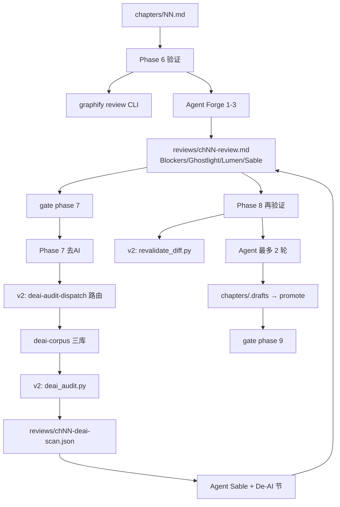

### 8.2 Phase 6 目录（现有）

```text
skills/novel-review/
├── SKILL.md
└── references/
    ├── node-dispatch.md          → P6/P7/P8 合表
    ├── forge-workflow.md         → 阶段 1-5
    ├── soft-critics.md
    ├── deai-checklist.md         → Phase7 短清单（非 1000+ 词库）
    ├── platform-compliance.md
    └── personas/
        ├── ghostlight.md
        ├── lumen.md
        └── sable.md

novels/<slug>/reviews/chNN-review.md

engine/scripts/graphify_bridge.py   → novel_cli review 实际调用

engine/scripts/review_blocker_scan.py → `novel audit blocker`
```

### 8.3 Phase 7 目录（**你要求的审计链 — 核心放大**）

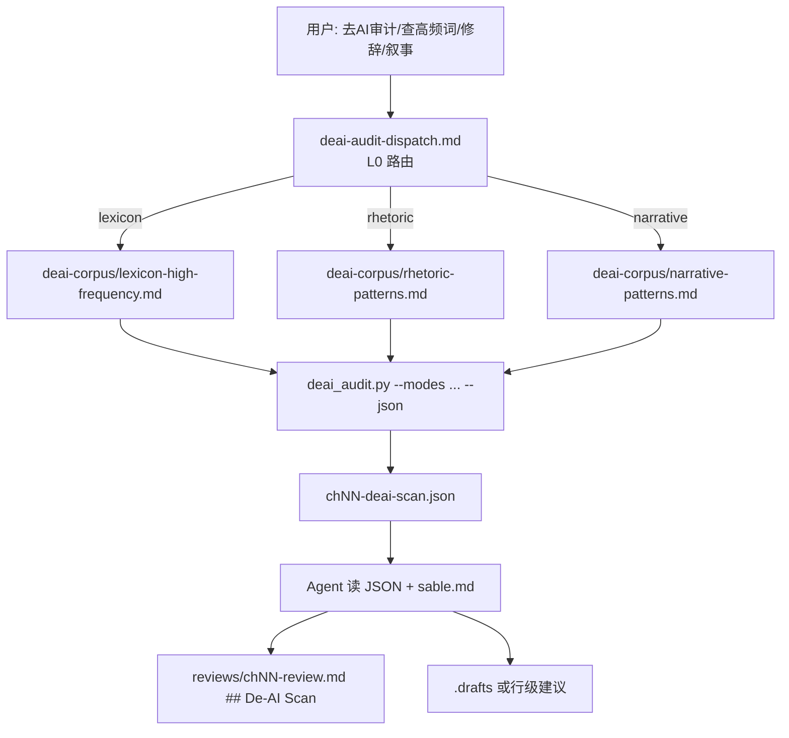

```text
cursor-novel-writer/skills/novel-review/references/
├── deai-audit-dispatch.md
└── deai-corpus/
    ├── README.md
    ├── lexicon.txt                 → 800+ 行（脚本读）
    ├── lexicon-high-frequency.md
    ├── rhetoric-patterns.md
    └── narrative-patterns.md

engine/scripts/deai_audit.py        → `novel audit deai`

novels/<slug>/reviews/chNN-deai-scan.json
```

**流程：** L0 路由 → L1 语料 → L2 CLI → Agent
[deai-checklist.md](../../cursor-novel-writer/skills/novel-review/references/deai-checklist.md) + `## De-AI Scan`。

### 8.4 Phase 8

```text
templates/review-repair-spec.md

engine/scripts/revalidate_diff.py     → `novel audit revalidate`
```

---

## 9. Phase 9 — 导出

### 9.1 传递方向

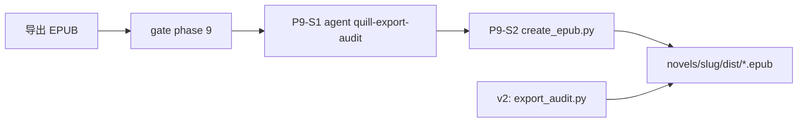

### 9.2 目录架构

```text
skills/novel-export/references/
├── node-dispatch.md
└── quill-export-audit.md

engine/scripts/create_epub.py
src/novel_suite/writer/export.py

engine/scripts/export_audit.py        → `novel audit export`
```

---

## 10. 视频节点 V0–V2（绑定小说章节）

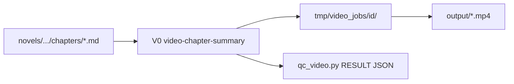

| 节点 | 分派表 | 引擎 |
| --- | --- | --- |
| V0 | [video-chapter-summary/node-dispatch.md](../../cursor-novel-video/skills/video-chapter-summary/references/node-dispatch.md) | [video_cli.py](../../cursor-novel-video/engine/video_cli.py) |
| V1 | [video-scene-drama/node-dispatch.md](../../cursor-novel-video/skills/video-scene-drama/references/node-dispatch.md) | drama 管线 |
| V2 | [video-export/node-dispatch.md](../../cursor-novel-video/skills/video-export/references/node-dispatch.md) | 导出/QC |

[cursor-novel-video/engine/scripts/video_script_lint.py](../../cursor-novel-video/engine/scripts/video_script_lint.py)
→ `novel audit video-script` · 写视频前先 `novel audit format`

---

## 11. 总控与门控（所有 Phase 汇聚）

```text
cursor-novel-writer/skills/novel-pipeline/
├── SKILL.md
└── references/node-dispatch.md     → Phase→Skill 路由

docs/standards/NODE-EXECUTION-CONTRACT.md

engine/scripts/
├── pipeline_gate.py                → 阶段门控（schema/task_plan/review 节）
└── node_completion.py              → manifest 同步（偏「文件存在」）

AGENTS.md                           → 对话话术入口
```

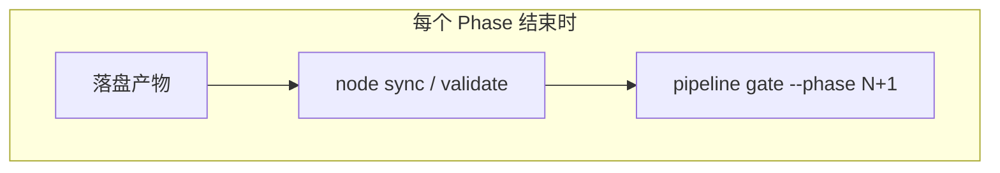

---

## 12. 与你截图「二、分 Phase 加厚要点」的对应关系

| 图中 Phase | 本节章节 | 传递方向是否正确 |
| --- | --- | --- |
| P0 | §2 | ✅ hybrid 已存在；v2 加篇幅语料 |
| P1 | §3 | ✅；v2 加 init 审计 |
| P2 | §4 | ✅；已有 relations check |
| P3 | §5 | ✅；**12 节拍≠12 正文** 是关键 |
| P4 | §6 | ✅ |
| P5 | §7 | ✅；**缺 format lint 脚本** |
| P6 | §8.2 | ✅；review CLI≠deai |
| P7 | §8.3 | ✅；**审计链为规划态** |
| P8 | §8.4 | ✅ |
| P9 | §9 | ✅ |
| V0–V2 | §10 | ✅ |

---

## 13. 建议阅读顺序（点击练习）

1. [workflow/README.md](./README.md) — Phase 索引  
2. [novel-pipeline node-dispatch](../../cursor-novel-writer/skills/novel-pipeline/references/node-dispatch.md)
   — 选 Phase  
3. 打开对应 Phase 的 `node-dispatch.md`（上表各节）  
4. 审稿链：[forge-workflow.md](../../cursor-novel-writer/skills/novel-review/references/forge-workflow.md)
   → [§8.3 deai-corpus](#83-phase-7-目录你要求的审计链--核心放大)  
5. 篇幅规划：[PLATFORM-LENGTH-AND-NORMS.md](../standards/PLATFORM-LENGTH-AND-NORMS.md)  
6. 审计索引：[AUDIT-REFERENCES-INDEX.md](../standards/AUDIT-REFERENCES-INDEX.md)

---

## 14. NEC-11 实施进度

| Phase | L0 | L1 | L2 | L4/manifest | 状态 |
| --- | --- | --- | --- | --- | --- |
| P0 | node-dispatch | [platform-length-corpus.md](../../cursor-novel-writer/skills/novel-market-scan/references/platform-length-corpus.md) | [intel_rubric_score.py](../../cursor-novel-writer/engine/scripts/intel_rubric_score.py) | radar completion | done |
| P1 | node-dispatch | story-template | [story_init_audit.py](../../cursor-novel-writer/engine/scripts/story_init_audit.py) | phase-1.completion | done |
| P2 | node-dispatch | bidirectional-relations | [canon_lint.py](../../cursor-novel-writer/engine/scripts/canon_lint.py) + relations | phase-2.completion | done |
| P3 | node-dispatch | plot-frameworks + plot templates | [plot_scale_audit.py](../../cursor-novel-writer/engine/scripts/plot_scale_audit.py) | phase-3.completion | done |
| P4 | phase-4 dispatch | voice-brief template | [voice_brief_lint.py](../../cursor-novel-writer/engine/scripts/voice_brief_lint.py) | phase-4.completion | done |
| P5 | node-dispatch | chapter-format | [chapter_format_lint.py](../../cursor-novel-writer/engine/scripts/chapter_format_lint.py) | format_scan_json | done |
| P6 | forge + audit index | — | [review_blocker_scan.py](../../cursor-novel-writer/engine/scripts/review_blocker_scan.py) | blocker/format scan | done |
| P7 | [deai-audit-dispatch.md](../../cursor-novel-writer/skills/novel-review/references/deai-audit-dispatch.md) | [deai-corpus](../../cursor-novel-writer/skills/novel-review/references/deai-corpus/README.md) | [deai_audit.py](../../cursor-novel-writer/engine/scripts/deai_audit.py) | deai_scan_json | done |
| P8 | node-dispatch | review-repair-spec | [revalidate_diff.py](../../cursor-novel-writer/engine/scripts/revalidate_diff.py) | review | done |
| P9 | node-dispatch | quill-export-audit | [export_audit.py](../../cursor-novel-writer/engine/scripts/export_audit.py) | dist/epub | done |
| V0 | video node-dispatch | PIPELINE | [video_script_lint.py](../../cursor-novel-video/engine/scripts/video_script_lint.py) | job output | done |

**入口：** `python cursor-novel-writer/engine/novel_cli.py audit <mode> --project …` · 详见
[audit-dispatch-index.md](../../cursor-novel-writer/skills/novel-review/references/audit-dispatch-index.md)。
