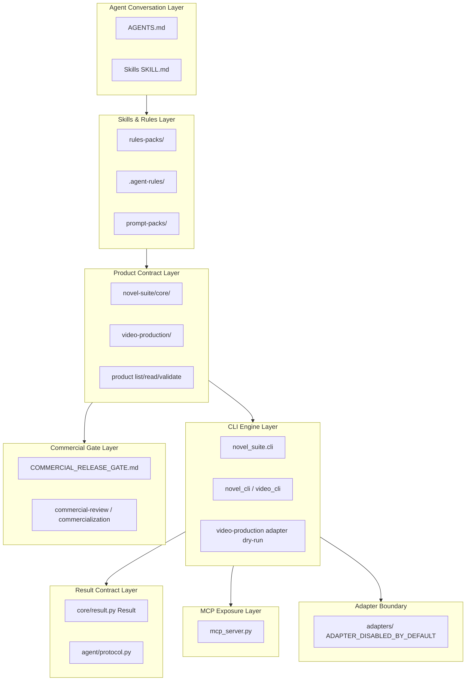

# Agent 架构分层

## 逻辑层级

```text
IDE Agent 对话入口
  -> Skills / AGENTS / Rules Pack
  -> Workflow / Product Layer / Gates
  -> CLI Engine / Dry-run Adapter
  -> JSON Result Contract
  -> MCP Tools / Multi-IDE Distribution
```



## 各层职责

### 1. Agent Conversation Layer

- **职责**：用户自然语言入口；路由到正确 Skill 或 pipeline。
- **证据**：`AGENTS.md`（默认 `novel-pipeline` 总控）、各 IDE Agent 对话窗。
- **不负责**：直接执行外部 API；应 delegate 到 Skill → CLI。

### 2. Skills & Rules Layer

- **职责**：可复用 SOP 正文、触发词、步骤约束；多 IDE 薄规则指向中立 Core。
- **证据**：`cursor-novel-writer/skills/*/SKILL.md`、`novel-suite/rules-packs/`、`.agent-rules/`（B6 分发）。
- **原则**：Rules Pack 不复制 Skill 全文，只指向 `novel-suite/core/`。

### 3. Product Contract Layer

- **职责**：中立契约、工作流、门禁、video-production 规格；只读索引。
- **证据**：`novel-suite/core/contracts/`、`novel-suite/video-production/`、`product_layer.py`（C4）。
- **输出**：结构化文档与 JSON 样例，非成片。

### 4. CLI Engine Layer

- **职责**：确定性执行：doctor、gate、chapter、video job、memory、analytics、commercial-review validate 等。
- **证据**：`src/novel_suite/cli.py`、`pyproject.toml` entry `novel-suite`。
- **Dry-run**：C5 `video-production adapter dry-run`（P1）。

### 5. Result Contract Layer

- **职责**：所有 CLI/MCP 工具返回统一 JSON，供 Agent 解析与分支。
- **证据**：

```python
# src/novel_suite/core/result.py — Result(status, code, message, artifacts, next_actions, details)
```

- **解析**：`src/novel_suite/agent/protocol.py` — `parse_result(stdout)`.

### 6. MCP Exposure Layer

- **职责**：将选定 CLI 能力注册为 MCP tools，供 Cursor 等 IDE 子进程调用。
- **证据**：`src/novel_suite/mcp_server.py` — `tool_product_*`、auth、publish、analytics 等。
- **安全**：stdio 本地；勿无认证暴露公网。

### 7. Adapter & External Tool Boundary

- **职责**：TTS、图像、视频、平台发布 — **默认关闭**；handoff 文档 + dry-run plan。
- **证据**：`novel-suite/adapters/*/ADAPTER_DISABLED_BY_DEFAULT.md`、`video-production/handoff/`、C5 skeleton。

### 8. Commercial Gate Layer

- **职责**：商业发布前阻断误导性 claims；C6/C7 审查清单。
- **证据**：`COMMERCIAL_RELEASE_GATE.md`、`commercial-review/release-blockers.md`、`commercialization/prelaunch-gate.md`。

## 数据流示例（只读 product validate）

```text
User: "检查产品层是否完整"
  -> Agent reads novel-review / doctor skill or direct CLI instruction
  -> subprocess: novel-suite product validate --json
  -> stdout: {"status":"ok","code":"PRODUCT_VALIDATE_OK",...}
  -> Agent parses Result -> reports to user
```

## 与工程目录映射

| 架构层 | 路径 |
| --- | --- |
| 对话入口 | `AGENTS.md` |
| Skills | `cursor-novel-writer/skills/`, `cursor-novel-video/skills/` |
| 产品层 | `novel-suite/` |
| 引擎 | `src/novel_suite/` |
| MCP | `src/novel_suite/mcp_server.py` |
| 多 IDE 规则 | `novel-suite/rules-packs/`, `.agent-rules/` |
| 试跑 | `novel-suite/trial-cards/` |
